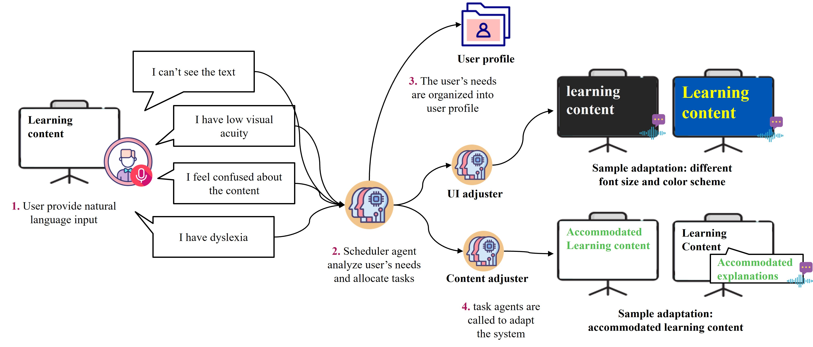
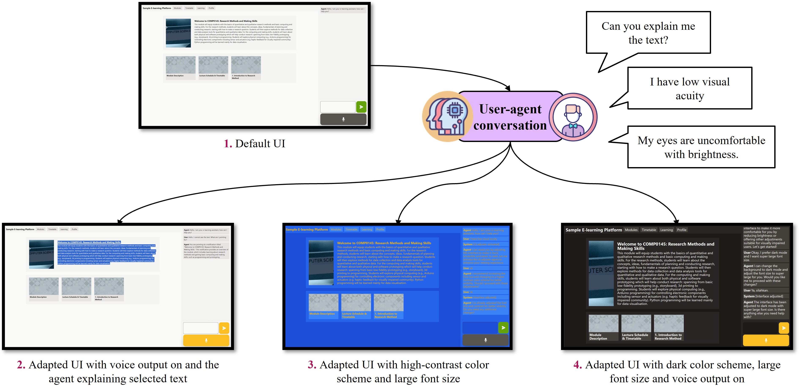

# LLM-driven Adaptive E-learning Prototype

This repo is a client-side implementation of the concept.

## Project Abstract

Traditional e-learning systems often fail to accommodate the diverse needs of learners, particularly those with disabilities, due to their one-size-fits-all user-interface design. This paper explores the use of Large Language Model (LLM) powered adaptive e-learning systems to enhance educational accessibility and inclusivity. Our conversationally-driven approach focuses on facilitating real-time adjustments to accommodate sensory, cognitive, and environmental differences. A web-based prototype demonstrates how the system can tailor educational content, adapt interfaces, and integrates accessibility features seamlessly. From initial observations, we find that this approach has the potential to improve inclusivity by catering to diverse differences, establishing a promising foundation for further development in adaptive e-learning research.

In the prototype, users can easily transform text on the interface into conversational audio output and make UI adjustments by chatting with the agent, and highlights how for students with visual or cognitive impairments, the process of navigating or adjusting an unfamiliar learning system demonstrates substantial potential in smoothing the challenges they may face in traditional e-learning platforms. 

## System design

